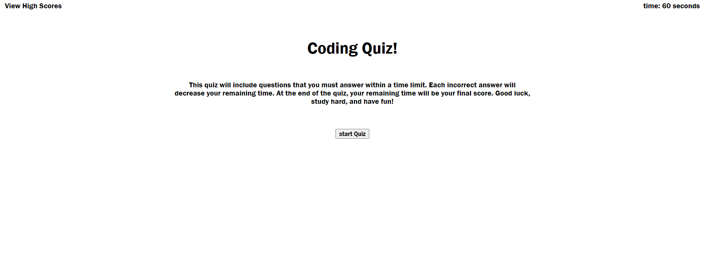

# Code-Quiz

# <Code-Quiz>

## Description

Students enrolled in coding bootcamps would like more opportunities to study. In order to give them easy access to important study material I created an online quiz. It asks relevent questions and gives a score based on time and accuracy. The faster and more accurately a student takes the quiz, the higher score they will acheive. High scores are stored and easily viewed so that a student may see their progress or compare it with other students.

## Usage

Visit the finished product here: https://tessshearer.github.io/Code-Quiz/

